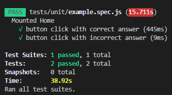
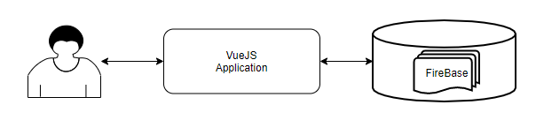
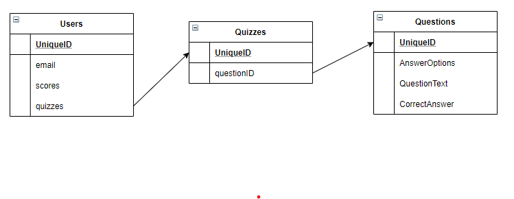

# QuizGame
## Team Doshirak
Develop a web-application for quizzes

## Team Members
1. [Pavel Vybornov](https://github.com/pavvyb) - Programmer
2. [Amadey Kuspakov](https://github.com/) - SCRUM-Master

## Organization
Daily meetings, retrospective, sprint planning, and sprint review are all organized in the following way:
- sprint planning - every Tuesday
- daily meetings - 10pm (GMT+3) every working day
- sprint review - every Sunday
- sprint restrospective - after each sprint review

## Technologies
* [GitHub](https://github.com/IU-IPOD-F20/map-projects-teamDoshirak) - Project Backlog, Sprint Backlogs, Sprint Boards, Burndown Charts
* [VueJS](https://vuejs.org) - Frontend part
* [Telegram](https://web.telegram.org/#/login) - Fast communication, daily meetings, planning and retrospective
* [FireBase](firebase.google.com) - Database and Backend

## Sprint Evaluations


# How to run the project

## Clone the repository

1. `git clone https://github.com/IU-IPOD-F20/map-projects-teamDoshirak.git`
2. `cd map-projects-teamDoshirak`
3. `cd quizgame`

## Install the dependencies

1. `npm install`

## Run the application
1. `npm run serve`
2. wait until the message appears:
```
 App running at:
  - Local:   http://localhost:8080/
  - Network: http://192.168.0.81:8080/
```
3. open the link that is in "Local" in your browser

### Remarks
For now, it is not quite clear what the interface does without an explanation. The reason is that the application creation is in progress

# Testing
## How to run tests
1. Go to the root directory of the project
`map-projects-teamDoshirak/quizgame`
1. Run 
`npm test`

## Test coverage


[x] Tested functions in the application
[] Tested user input

# Branching policy
- Adding new feature
`feature/featurename`
- Adding tests
`testing/unit`
- Changing the documentation
`documentation/documentname`

# Project architecture
### General scheme

### Database scheme


# Other Documentation
- [User Documentation](USERDOC.md)
- [Technical Documentation](TECHDOC.md)
