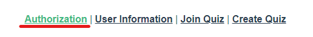
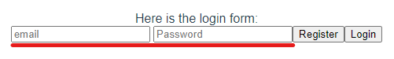
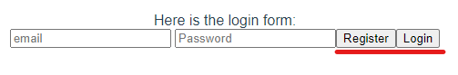
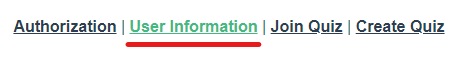
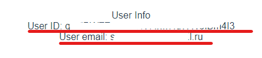
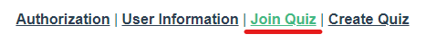
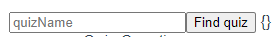
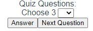

# User Documentation

## Sign In / Register
Perform the following steps to sign in or register

1. Choose the "Authorization" field in the navigation bar on the top of the page

2. Enter Your credentials

3. Click Register or Login button depending on your purpose

## Accessing Personal Information
Perform the following steps to access information about your account

1. Choose the "User Information" field in the navigation bar on the top of the page

2. Your ID and Email will be displayed on the page

## Participating in Quiz
Perform the following steps to take part in the quiz that already exists

1. Choose the "Join Quiz" field in the navigation bar on the top of the page

2. Enter quiz ID into the dedicated field and press Find Quiz button

3. Congratulations! Now you can answer the questions!

## Creating a new Quiz
This option will be available soon...